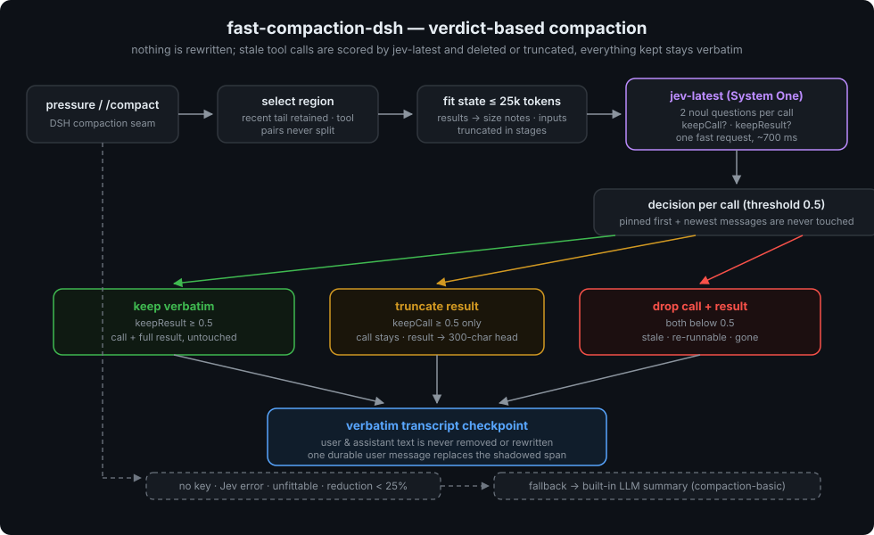

# fast-compaction-dsh

[English](README.md) | 中文

**[DeepSeek Harness](https://github.com/deepseek-ai/deepseek-harness)（DSH）的 verdict 式上下文压缩插件。** 用 [`jev-latest`](https://api.typesafe.ai) 对每个工具调用做快速的 保留/截断/删除 判定，替换掉有损的压缩摘要——保留的内容**逐字不动**，任何东西都不会被改写。

[tamaratran/fast-jev-compaction](https://github.com/tamaratran/fast-jev-compaction)（MIT）的 DSH 移植，适配 DSH 的 compaction capability seam。



## 它做什么、为什么

常见的上下文压缩是让 LLM 把旧对话总结成摘要。摘要有损：文件路径、精确报错、约束、命令——后面要用到时可能已经消失了。这个插件从不改写任何内容。压缩触发时，被压缩区间里的每个工具调用和结果都由 `jev-latest`（TypeSafe System One 端点）打分：过期的删除、半过期的截断为有限的头部、其余逐字保留。用户和助手的文本永远不会被删除。

任何失败——`TYPESAFE_API_KEY` 缺失、Jev 报错、答案畸形、历史装不下、缩减不足——都回退到 shipped `compaction-basic` 的内置 LLM 摘要，与原 Claude Code 钩子回退 Claude Code 内置摘要的行为一致。

## 工作方式

1. 每个 `tool-call` 按 call id 与其 `tool-result` 配对。首条消息和最近 `preserveRecentMessages`（默认 6）条消息固定不动。
2. 发给 Jev 的 **state** 是整个被压缩区间（ oldest first ），工具结果替换为短注（`ok, 4213 chars (omitted)`）。工具输入和文本都保留——不做任何摘要。
3. state 分阶段装进 `maxStateTokens`（默认 25k）：工具输入截断 1000 → 200 → 60 字符；长文本保留头尾，从最早的非固定消息开始；旧消息折叠为一行注；旧调用压缩为一行；无调用的旧消息丢弃；连续纯调用消息合并。仍装不下则回退。
4. 每个非固定调用向 Jev 提两个 `noul` 问题：**调用**该不该留（知道这个调用发生过、带着它的输入，对后续仍重要），**结果**该不该逐字留（内容仍需要，且重跑工具得不到）。
5. 问题按 state + 问题 ≤ `maxRequestTokens`（默认 30k）分批，批次并发发送、答案合并。
6. 按 `keepThreshold`（默认 0.5）决策：`keepResult` 达标 → 整对逐字保留；否则 `keepCall` 达标 → 保留调用、结果截断为前 `truncateHeadChars`（默认 300）字符加一行注；都不达标 → 调用连结果一起删。
7. 区间重建为 verbatim 转录 checkpoint（DSH seam 用一条持久 user 消息替换被遮蔽的 surface 区间），带角色标签，保留的工具活动内联。

实测一个真实区间：Jev 打分往返约 **700 ms**。

## 如何接入 DSH

DSH 把压缩暴露为 capability seam：`ctx.compaction`（服务定义）、引擎提供者（`compaction-basic`）、`/compact` 消费者。引擎只有一个文档化的定制钩子 `summarize()`——本插件子类化 `BasicCompactionEngine` 并只覆盖这个钩子，因此区间选择、持久事务（锁、事件、稳定性检查、收缩校验）、checkpoint 框架、`/compact` 全部原样工作。

shipped `standard` agent preset 把 `compaction-basic` 装在带 isolate realm 的 compaction group 里，所以引擎行必须经 **agent preset patch** 挂载——不能放在 profile 级 `cordis.patch.yml`：

```yaml
# ~/.dsh/.agent-presets/fast/agent.cordis.yml
- id: standard
  name: cordis:include
  config:
    path: 'file:///path/to/deepseek-harness/packages/preset/agent-presets/presets/standard/agent.cordis.yml'
    patches:
      - id: compaction-basic
        disabled: true
      - id: compaction
        insert:
          - id: fast-compaction
            name: 'file:///path/to/fast-compaction-dsh/src/index.ts'
            # config: { keepThreshold: 0.5, ... }   # 全部可选
```

再在 `~/.dsh/cordis.patch.yml` 把默认 preset 指过去：

```yaml
- id: agent-presets
  config:
    default: fast
```

重启 DSH。新会话的压缩即走 `jev-latest`；日志里看到 `fast-compaction-dsh: kept N/M calls verbatim (…)` 即生效。

同一个包还自带这台引擎的 **Web 设置卡片**（[`web/`](web/) 下的 `fast-compaction-dsh/web` 与 `fast-compaction-dsh/client` 入口）。要拿到卡片，把包加进 web profile 并启用 bundle，然后重启：

```jsonc
// ~/.dsh/profiles/web/package.json
"dependencies": { "fast-compaction-dsh": "link:/path/to/fast-compaction-dsh" },
"dsh": { "profile": { "bundles": [ ..., "fast-compaction-dsh" ] } }
```

bundle patch 只在 web profile 里挂载"设置命名空间注册"这一个入口；引擎照旧由上面的 agent 预设挂载，web profile 永远不会加载 `src/index.ts`。

## 查看实际压缩效果

不用碰命令行——GUI 里就有两层，外加两个可选渠道：

1. **聊天流标记**：压缩发生后聊天流里出现可展开的标记行（`N 项 · M tokens`），展开即可看到模型当前实际看到的逐字 transcript，被截断的工具结果带 `[fast-compaction-dsh truncated …]` 标记。
2. **轨迹页（裁决明细在这里）**：会话视图切到 **轨迹** 标签 → 找到 `Compaction` 组 → 点击压缩单元格，右侧检查器有两个标签：
   - **概述**：重建后的 transcript（模型现在看到的上下文），Markdown 渲染；
   - **原始输出**：第 1 块是本插件生成的**可读裁决报告**（汇总统计 + 每条 tool call 的 `keepCall`/`keepResult` 概率和最终动作的对齐表格），第 2 块是原始 `{decisions, stats, stateStage}` JSON。
3. **检查脚本**（离线、只读，跨会话批量看时方便）：

   ```sh
   pnpm run inspect:compaction          # 当前目录的会话
   pnpm run inspect:compaction -- --all # 全部工作区
   ```

   渲染每次压缩的汇总和逐条裁决表（从 `compaction/summary` 事件的 `rawOutput` 里解析 JSON 块）。`--json` 输出机器可读结果。
4. **服务日志**：`journalctl -u deepseek-harness.service | grep fast-compaction`——每次裁决一行摘要，fallback 时也有告警。

还没触发过压缩？在 `fast` 预设的会话里发 `/compact`，或把 preset 配置里的 `thresholdRatio` 调低。

## 环境要求

- Node.js ≥ 22.19（插件是 TypeScript 源码，由 DSH loader 直接经 type stripping 加载）。
- 一个 [DeepSeek Harness](https://github.com/deepseek-ai/deepseek-harness) 源码检出（developer preview）——开发和 `link:` dev 依赖要求它作为本仓库的**同级目录**（或自行调整 `package.json` 里的 `link:` 路径）。
- TypeSafe API key：在 DSH 进程环境里 `export TYPESAFE_API_KEY=...`（或写在 preset 行的 `config.apiKey`）。没有 key 时插件行为与 `compaction-basic` 完全一致。

## 配置

全部可选。有两层，叠加生效：

1. **settings.yaml 用户层**（`~/.dsh/settings.yaml` 的 `fast-compaction:` 段）——逐字段优先，**改动即时生效**于后续压缩（引擎监听 settings 服务的热发布，apiKey/model/baseUrl 变化会就地重建 Jev 传输），无需重启。推荐用本包自带的 Web 设置卡片（[`web/`](web/)，即 `fast-compaction-dsh/client` 入口）在插件的 Configure 页编辑（apiKey 以 secret 形式存储，永不上线传输原文）。
2. **preset patch 的 `config:`**（组合层）——per-preset 的基础值，改动需重启 DSH。

单字段优先级：settings.yaml 用户层 > preset `config:` > 环境变量（仅 `apiKey` 走 `TYPESAFE_API_KEY`）> 代码默认值。未列字段透传给 `compaction-basic`（`thresholdRatio`、`retainRatio`、`retainTokens`、`summarizationProvider`、`summarizationModel`、`maxTokens`、`compactionRetries`、`maxOverflowRetries`、`modelPolicies`、`auto`）。

注意：settings 段的字段值非法（如把 `keepThreshold` 写成字符串）时，整个 settings 层会被禁用并回落到组合层（日志有告警），进程重启后重试。

| 字段 | 默认 | 说明 |
| --- | --- | --- |
| `apiKey` | `TYPESAFE_API_KEY` | TypeSafe API key |
| `model` | `jev-latest` | Jev 模型名 |
| `baseUrl` | `https://api.typesafe.ai/v1/systemone` | System One 端点 |
| `keepThreshold` | `0.5` | 调用/结果的最低保留概率 |
| `preserveRecentMessages` | `6` | 最新 N 条消息固定不动（首条永远固定） |
| `maxStateTokens` | `25000` | state 的估算 token 上限 |
| `maxRequestTokens` | `30000` | state 加一批问题的上限 |
| `truncateHeadChars` | `300` | 被截断结果保留的头部字符数 |
| `minReduction` | `0.25` | 低于该缩减率回退内置摘要 |
| `disabled` | `false` | 关闭 verdict 路径，只用内置摘要 |

## 与原库的差异

- 原库原地改写 Claude Code 的消息列表；DSH seam 用**一条 user 消息**替换被遮蔽区间，所以保留内容重建成带角色标签的 verbatim 转录（`<user>`/`<assistant>`/`<tool-call>`/`<result>`）。文本仍逐字不动。
- 助手的 reasoning 块不进入转录（中间思考对续接任务无用）。
- pin 语义带 system head 修正：`messages[0]` 是 system 消息时，首条对话消息同样固定。
- Jev 调用不经 DSH 的 `ctx.llm` seam；摘要结果按 remote（未标记）变体记账，`provider` 记 `typesafe`，并记录 Jev 的 token usage。

## 开发

```sh
pnpm install        # link: 依赖要求 ../deepseek-harness 存在
pnpm run typecheck
pnpm test           # 42 个单元/集成测试，无网络
TYPESAFE_API_KEY=... node scripts/e2e.ts   # 对真实端点跑 verdict 路径的活检
```

结构：`src/jev.ts`（System One 传输 + noul 协议）、`src/state.ts`（state 拟合）、`src/pairing.ts`（调用/结果配对）、`src/rebuild.ts`（决策 + verbatim 转录）、`src/index.ts`（引擎）。

## 许可证

MIT——见 [LICENSE](LICENSE)。移植自 [tamaratran/fast-jev-compaction](https://github.com/tamaratran/fast-jev-compaction)（MIT）；`noul` 问题措辞、state 拟合阶段、决策阈值均逐字沿用。
